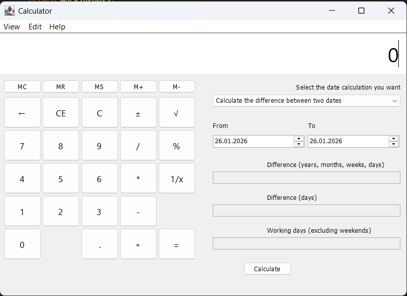

# Java Scientific & Date Calculator 🧮

O aplicație desktop versatilă dezvoltată în **Java**, care combină funcțiile unui calculator aritmetic cu un modul avansat pentru calculul perioadelor de timp.

## ✨ Caracteristici

### 1. Calculator Standard & Memorie
* **Operații de bază:** Adunare, scădere, înmulțire și împărțire.
* **Funcții suplimentare:** Rădăcină pătrată, procente, inversul numărului ($1/x$) și schimbare semn ($\pm$).
* **Sistem Memorie:** Suport complet pentru funcțiile `MC`, `MR`, `MS`, `M+`, `M-`.

### 2. Modul Calcul Date (Date Calculation)
* **Diferență Detaliată:** Calculează intervalul exact în ani, luni, săptămâni și zile.
* **Total Zile:** Afișează numărul total de zile dintre două date selectate.
* **Zile Lucrătoare:** Calculează automat numărul de zile lucrătoare, **excluzând zilele de weekend** (Sâmbătă și Duminică).

## 🛠️ Tehnologii Utilizate

* **Java SE:** Nucleul aplicației.
* **Swing & AWT:** Pentru construcția interfeței grafice (GUI).
* **Java Time API:** Utilizat pentru manipularea precisă a datelor calendaristice.

## 📝 Utilizare
Aplicația este intuitivă:
* Folosește panoul din stânga pentru calcule matematice rapide.
* Folosește panoul din dreapta pentru a alege două date din selector.
* Apasă butonul **Calculate** pentru a vedea diferența de timp și numărul de zile lucrătoare.

---
